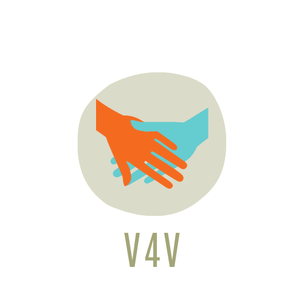

# V4V E-Selling Website
<table>
<tr>
<td>
  V4V is an E-commerce website which primarily focus on selling the products by locals vendors and small business owners who cannot bear the cost of maintaing the website and are not familiar with the technologies to operate the website. 
</td>
</tr>
</table>

## Problem Statement
Due to outbreak of the Covid-19 pandemic, these vendors and small businessman have lost their source of income.They are getting huge competition from e-commerce websites
and digitalization. In Delhi, out of roughly 300,000 street vendors, only about 131,00 have some form of occupational identification.Extortion by local police and municipal authorities.

## Our Objective
The main objective of our project is to create a website where the products manufactured by local vendors are sold. The project revolves around the tagline “VOCAL FOR LOCAL” and thus the name V4V which means “Vocal For Vendors”. The main focus will remain to promote the products of local vendors and small businesses so their product and business reach out to maximum people. 

## Demo
Here is a working live demo : https://v4v-live.herokuapp.com/

## Site

### Logo
This is the logo which was designed using Canva.

### Landing Page
This is the landing page of our website which is the first thing the user see when they visit the website.

### Header
The header section contains zip code,shop,contact and sign in buttons. It also contains a shopping cart where user can see the number of item present in their shopping bag.

## Built with 

- [React](https://reactjs.org/docs/getting-started.html) - Reacts helps to make single page web applications. This means that the page will not load again and again while the user explore the website or go from one page to another.
- [SASS](https://sass-lang.com/documentation) - Sass is a stylesheet language that’s compiled to CSS. It allows you to use variables, nested rules, mixins, functions, and more, all with a fully CSS-compatible syntax.
- [Bootstrap](http://getbootstrap.com/) - Extensive list of components and  Bundled Javascript plugins.
- Google Firebase
- Context API
- Stripe API - For payment interface testing.

## To-do
- Complete the functionality of Zip Code.
- Implement a payment gateway so that user can get through the payment process easily.

## Team
- Amitesh Mani Tiwari
- Md Asif Zafar
- Pratibha Rawat
- Nandni

